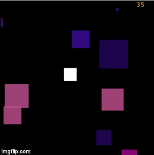

# The Square Game

This was made during my time as a student at Code Chrysalis.

I created this project to teach myself how to make games in JavaScript.

(Here is a [tech talk](https://youtu.be/GPU-q2YyWyo?t=5766) where I talk about what I learned.)

## How to Play

Move the white square with the arrow keys.

Avoid squares that are larger than you.

Run into squares that are smaller than you to "eat" them and grow larger.
